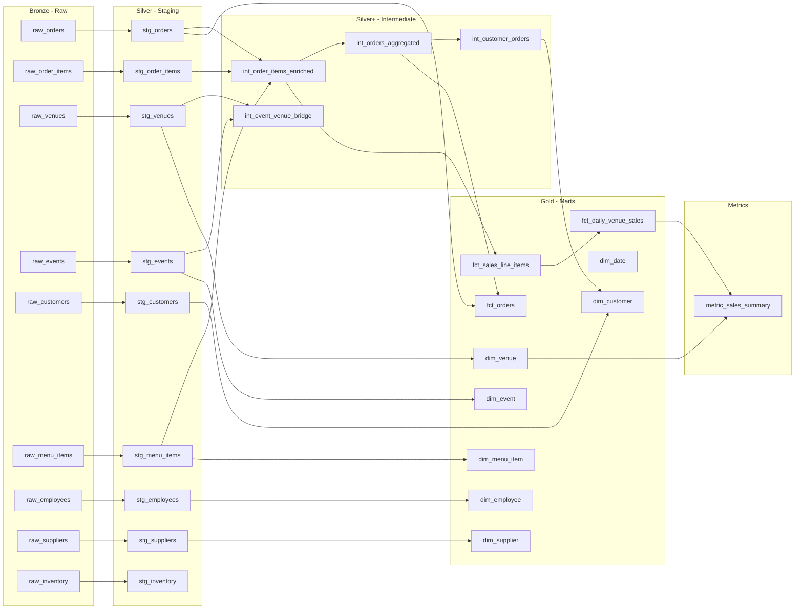

# Stadium Concessions Analytics — dbt Project

[](https://github.com/chinanu9a/dev-snowflake-dbt-analytics-platform/actions/workflows/dbt-ci.yml)

A production-grade **dbt** project demonstrating senior-level data engineering practices for **restaurant and stadium concessions analytics**. Built for a Snowflake + dbt + AWS stack, but fully runnable locally with **DuckDB** (no cloud credentials required).

---

## Architecture

```
Raw (Seeds/CSV)  →  Staging (stg_*)  →  Intermediate (int_*)  →  Marts (dim_*, fct_*)
     Bronze              Silver              Silver+                    Gold
```



### Snapshots (SCD Type 2)

| Snapshot | Tracks |
|---|---|
| `snap_customers` | Customer loyalty tier and profile changes |
| `snap_menu_item_prices` | Menu item price history |

---

## Repository Structure

```
├── .github/workflows/
│   └── dbt-ci.yml              # CI pipeline (DuckDB)
├── analysis/
│   └── sample_queries.sql      # Example analytical queries
├── macros/
│   ├── cents_to_dollars.sql    # Currency conversion macro
│   ├── generate_schema_name.sql# Schema name override
│   ├── safe_cast.sql           # Safe type casting
│   └── union_relations.sql     # Fiscal quarter/year helpers
├── models/
│   ├── staging/                # stg_* models + sources.yml
│   ├── intermediate/           # int_* models
│   ├── marts/
│   │   ├── core/               # dim_* + fct_* models
│   │   └── finance/            # fct_daily_venue_sales
│   └── metrics/                # Metric views + exposures
├── seeds/                      # Raw CSV data files
├── snapshots/                  # SCD snapshots
├── scripts/
│   ├── snowflake_setup.sql     # Snowflake DDL
│   └── load_seeds_to_snowflake.py
├── tests/
│   ├── generic/                # Reusable generic tests
│   └── singular/               # Singular assertion tests
├── dbt_project.yml
├── packages.yml
├── profiles_example.yml
├── requirements.txt
└── README.md
```

---

## Quick Start — Local (DuckDB)

### Prerequisites

- Python 3.9+
- pip

### Setup

```bash
# 1. Clone the repository
git clone https://github.com/chinanu9a/dev-snowflake-dbt-analytics-platform.git
cd dev-snowflake-dbt-analytics-platform

# 2. Create and activate virtual environment
python -m venv .venv
source .venv/bin/activate   # Linux/Mac
# .venv\Scripts\activate    # Windows

# 3. Install dependencies
pip install -r requirements.txt

# 4. Set up profiles (use the example file)
cp profiles_example.yml profiles.yml
export DBT_PROFILES_DIR=$(pwd)

# 5. Install dbt packages
dbt deps

# 6. Verify connection
dbt debug

# 7. Load seed data + build all models + run tests
dbt seed
dbt build

# 8. Generate documentation
dbt docs generate
dbt docs serve
```

After `dbt docs serve`, open http://localhost:8080 to browse the full data catalog, lineage graph, and column descriptions.

---

## Optional: Snowflake Setup

### Prerequisites

- Snowflake account with SYSADMIN access
- SnowSQL or Snowflake web UI
- Python `snowflake-connector-python` (for the data loading script)

### Steps

```bash
# 1. Run the setup script in Snowflake to create warehouse, database, schemas, and role
#    (use SnowSQL or paste into the Snowflake worksheet)
#    See: scripts/snowflake_setup.sql

# 2. Set environment variables
export SNOWFLAKE_ACCOUNT='your_account_identifier'
export SNOWFLAKE_USER='DBT_USER'
export SNOWFLAKE_PASSWORD='your_secure_password'
export SNOWFLAKE_ROLE='TRANSFORMER'
export SNOWFLAKE_DATABASE='ANALYTICS'
export SNOWFLAKE_WAREHOUSE='TRANSFORMING'

# 3. Update profiles.yml — uncomment the dev_snowflake target
#    and set: target: dev_snowflake

# 4. Option A: Load seeds via dbt
dbt seed --target dev_snowflake

# 4. Option B: Load seeds via Python connector (for large datasets)
pip install snowflake-connector-python pandas
python scripts/load_seeds_to_snowflake.py

# 5. Build
dbt build --target dev_snowflake
```

---

## Data Model

### Fact Tables

| Table | Grain | Key Measures |
|---|---|---|
| `fct_sales_line_items` | Line item | gross_sales, net_sales, line_discount, line_tax, total_cost, gross_margin |
| `fct_orders` | Order | gross_sales, net_sales, total_discount, total_tax, order_total, tip_amount |
| `fct_daily_venue_sales` | Venue x Date | order_count, net_sales, gross_margin, food/beverage/alcohol splits |

### Dimension Tables

| Table | Description |
|---|---|
| `dim_date` | Calendar dimension (2023-2025) |
| `dim_venue` | Stadiums, arenas, convention centers |
| `dim_event` | Games, concerts, conventions with attendance metrics |
| `dim_menu_item` | Menu catalog with pricing and margin data |
| `dim_customer` | Customer profiles with lifetime value and frequency segmentation |
| `dim_employee` | Concessions staff with venue assignments |
| `dim_supplier` | Supplier master data |

### Incremental Strategy

`fct_sales_line_items` and `fct_orders` use **incremental materialization** with `delete+insert` strategy, keyed on `updated_at`. This approach:
- Handles late-arriving data and retroactive adjustments
- Uses `delete+insert` (vs. merge) for simpler idempotent reloads
- Falls back to full refresh on schema changes

---

## Testing Strategy

### Generic Tests (schema.yml)

- `unique` and `not_null` on all primary keys
- `relationships` to enforce referential integrity across layers
- `accepted_values` on status and category fields

### Singular Tests (tests/singular/)

| Test | What It Validates |
|---|---|
| `assert_net_sales_non_negative` | No line item has negative net sales |
| `assert_taxes_non_negative` | No line item has negative taxes |
| `assert_order_total_matches_line_items` | Order-level totals match sum of line items (within $0.02 tolerance) |
| `assert_no_orphaned_order_items` | Every line item has a parent order in fct_orders |

### Custom Generic Test

- `positive_value` — reusable test asserting a numeric column >= 0

---

## Business Questions Answered

### 1. Sales by Venue / Event / Hour
```sql
SELECT v.venue_name, e.event_name, SUM(o.net_sales) as revenue
FROM fct_orders o
JOIN dim_venue v ON o.venue_id = v.venue_id
JOIN dim_event e ON o.event_id = e.event_id
GROUP BY 1, 2 ORDER BY revenue DESC;
```

### 2. Top Items with Discount Impact
```sql
SELECT item_name, SUM(gross_sales) as gross, SUM(line_discount) as discounts,
       ROUND(SUM(line_discount)/NULLIF(SUM(gross_sales),0)*100, 1) as discount_pct
FROM fct_sales_line_items
GROUP BY 1 ORDER BY discount_pct DESC;
```

### 3. Loyalty Repeat Rate
```sql
SELECT loyalty_tier, COUNT(*) as customers,
       SUM(CASE WHEN customer_frequency_segment = 'repeat' THEN 1 ELSE 0 END) as repeats,
       AVG(lifetime_net_sales) as avg_ltv
FROM dim_customer GROUP BY 1;
```

### 4. Inventory Shrink Risk
```sql
SELECT venue_id, item_name, quantity_on_hand, reorder_point,
       CASE WHEN quantity_on_hand <= reorder_point THEN 'REORDER' ELSE 'OK' END as status
FROM stg_inventory ORDER BY quantity_on_hand ASC;
```

---

## Interview Talking Points

### Why Incremental Models?
- Stadium concessions generate high-volume transactional data during events
- Full refreshes become expensive at scale; incremental loads process only new/changed records
- `delete+insert` strategy ensures idempotent reloads without merge complexity
- The `updated_at` column handles late-arriving adjustments (refunds, corrections)

### Testing Strategy
- **Defense in depth**: source-level tests catch bad data at ingestion, model-level tests validate transformations, singular tests enforce business rules
- Tolerance-based tests (order total matching) account for real-world rounding
- Referential integrity tests prevent orphaned records across the DAG

### Data Quality Enforcement
- Staging models standardize types, trim whitespace, and lowercase categorical values
- Sources define freshness checks — stale data triggers warnings before it reaches marts
- SCD snapshots preserve historical state for audit and trend analysis

### How Models Align to Business Questions
- **Grain matters**: `fct_sales_line_items` (item grain) supports item-mix analysis; `fct_orders` (order grain) supports basket analysis; `fct_daily_venue_sales` (date x venue) supports trends
- Dimensions are conformed — `dim_venue` and `dim_event` join consistently across all facts
- Pre-aggregated metrics layer reduces BI tool query complexity

---

## Documentation

Generate and serve the dbt documentation site:

```bash
dbt docs generate
dbt docs serve
```

The docs include:
- Full column descriptions and data types
- DAG lineage visualization
- Source freshness status
- Test coverage
- Exposure dependency mapping

---

## CI Pipeline

The GitHub Actions workflow (`.github/workflows/dbt-ci.yml`) runs on every push to `main` and on pull requests:

1. Sets up Python 3.11
2. Installs dbt-core + dbt-duckdb
3. Runs `dbt deps` -> `dbt seed` -> `dbt build` (models + tests)
4. Generates documentation

No cloud credentials are needed — CI runs entirely on DuckDB.

---

## Packages Used

| Package | Purpose |
|---|---|
| [dbt_utils](https://hub.getdbt.com/dbt-labs/dbt_utils) | Surrogate keys, schema tests, SQL helpers |
| [dbt_expectations](https://hub.getdbt.com/calogica/dbt_expectations) | Advanced data quality tests |
| [dbt_date](https://hub.getdbt.com/calogica/dbt_date) | Date dimension generation |

---

## License

MIT — see [LICENSE](LICENSE).
